# Microsoft-Sentinel-SOC-Honeypot-Lab
Cloud-based SOC honeypot lab using Microsoft Sentinel, Azure, KQL and Windows Security Events to detect, analyze, and visualize brute-force attacks

## Project Overview

This project demonstrates the deployment of a cloud-based **Security Operations Center (SOC) home lab** using Microsoft Azure and Microsoft Sentinel.

A Windows virtual machine was intentionally exposed to public Internet traffic within a controlled lab environment to observe real-world authentication attempts. Windows Security Events were collected in Azure Log Analytics, analyzed using **Kusto Query Language (KQL)**, enriched with geographic information, and visualized through a Microsoft Sentinel Workbook.

The project demonstrates several activities commonly performed by a SOC Analyst:

* Security log collection and monitoring
* Windows authentication log analysis
* Brute-force activity detection
* Source IP investigation
* KQL-based threat hunting
* GeoIP enrichment
* Security event aggregation
* SIEM investigation
* Microsoft Sentinel Workbook creation
* Global attack visualization

---

## Project Objective

The objective was to build a functional SIEM environment capable of collecting, analyzing, and visualizing suspicious Windows authentication activity.

The lab demonstrates how a SOC analyst can:

1. Deploy an Internet-facing Windows endpoint.
2. Collect Windows Security Event logs.
3. Centralize security logs in Azure Log Analytics.
4. Integrate Log Analytics with Microsoft Sentinel.
5. Detect failed authentication attempts using **Windows Event ID 4625**.
6. Investigate source IP addresses.
7. Enrich source IP addresses with geographic information.
8. Analyze authentication patterns using KQL.
9. Aggregate failed authentication attempts.
10. Build a Microsoft Sentinel Workbook.
11. Visualize authentication activity on a global attack map.

---

## Technologies Used

| Technology                       | Purpose                                                |
| -------------------------------- | ------------------------------------------------------ |
| **Microsoft Azure**              | Cloud infrastructure hosting the SOC lab               |
| **Azure Virtual Machine**        | Windows endpoint monitored during the project          |
| **Azure Virtual Network**        | Network environment for the virtual machine            |
| **Network Security Group (NSG)** | Controls inbound and outbound network traffic          |
| **Windows**                      | Endpoint generating authentication and security events |
| **Windows Event Viewer**         | Inspection of local Windows Security Events            |
| **Azure Log Analytics**          | Centralized log collection and querying                |
| **Microsoft Sentinel**           | SIEM platform for monitoring and investigation         |
| **Windows Security Events**      | Authentication and security telemetry                  |
| **Kusto Query Language (KQL)**   | Log searching, filtering, enrichment, and analysis     |
| **GeoIP Watchlist**              | Geographic enrichment of source IP addresses           |
| **Microsoft Sentinel Workbooks** | Visualization of security activity                     |

---

## Skills Demonstrated

* Microsoft Sentinel
* SIEM configuration and monitoring
* Azure security monitoring
* Windows Event Log analysis
* KQL querying
* Failed authentication analysis
* Brute-force detection
* Threat hunting
* Source IP investigation
* GeoIP enrichment
* Log aggregation
* Security visualization
* Network security
* SOC investigation workflow

---

## Lab Architecture

The lab consists of an Azure-hosted Windows virtual machine receiving unsolicited Internet traffic.

Windows Security Events generated by the VM are collected in a Log Analytics workspace. Microsoft Sentinel analyzes the centralized logs, while KQL is used to identify failed authentication attempts and investigate their source IP addresses.

The IP addresses are enriched with geographic information and visualized through a Microsoft Sentinel Workbook.

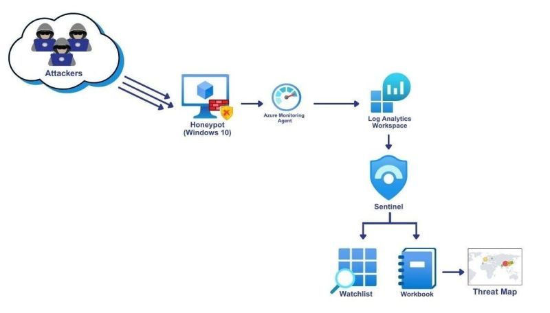

### Architecture Flow

```text
Public Internet
      |
      v
Azure Network Security Group
      |
      v
Windows Virtual Machine
      |
      v
Windows Security Events
      |
      v
Azure Log Analytics Workspace
      |
      v
Microsoft Sentinel
      |
      v
KQL Investigation
      |
      v
GeoIP Enrichment
      |
      v
Microsoft Sentinel Attack Map
```

---

# Lab Implementation

## Step 1 – Create the Azure Resource Group

A dedicated Azure Resource Group was created to organize all resources associated with the SOC lab.

```text
RG-SOC-Lab
```

The Resource Group provides a centralized container for the virtual machine, networking components, security controls, and monitoring resources.

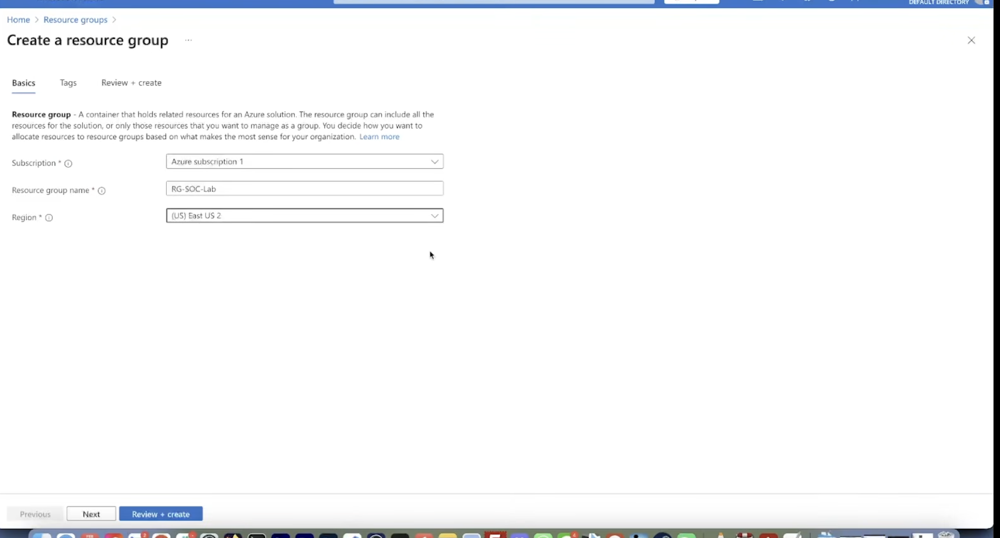

---

## Step 2 – Create the Virtual Network

A virtual network was created to provide network connectivity for the SOC lab.

```text
Virtual Network: Vnet-soc-lab
Address Space: 10.0.0.0/16
Subnet: 10.0.0.0/24
```

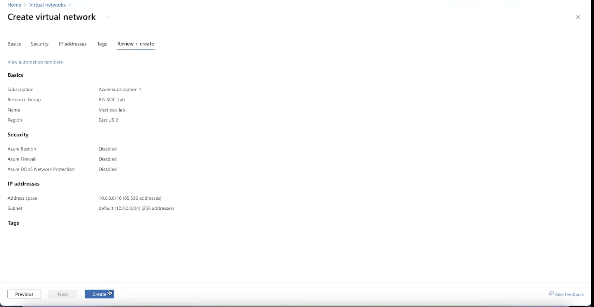

---

## Step 3 – Deploy the Windows Virtual Machine

A Windows virtual machine was deployed inside the SOC Resource Group.

The VM serves as the monitored endpoint and generates the authentication and Windows Security Events analyzed throughout the project.

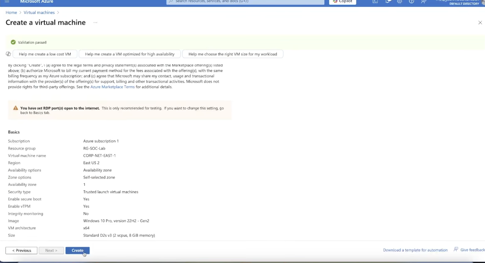

Azure confirmed successful deployment of the virtual machine and its supporting resources.

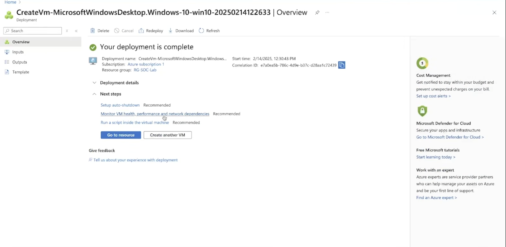

---

## Step 4 – Review the SOC Lab Resources

Deploying the virtual machine created several supporting Azure resources:

* Virtual Machine
* Public IP Address
* Network Security Group
* Network Interface
* Virtual Disk
* Virtual Network

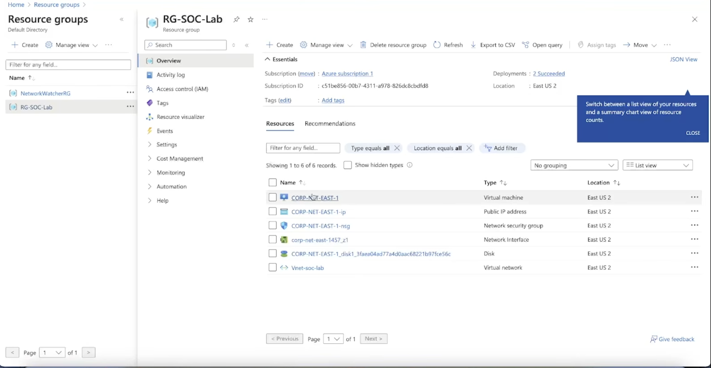

These components provide the compute, storage, networking, and security infrastructure required for the lab.

---

## Step 5 – Configure Network Exposure

To observe unsolicited authentication attempts, the virtual machine was intentionally exposed to public Internet traffic within the controlled lab environment.

The existing RDP-specific inbound rule was removed before configuring the lab's permissive NSG rule.

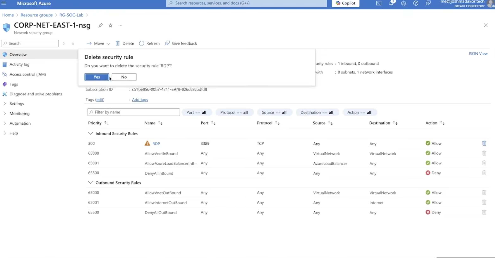

The Network Security Group was then configured to permit inbound traffic for the attack-observation portion of the lab.

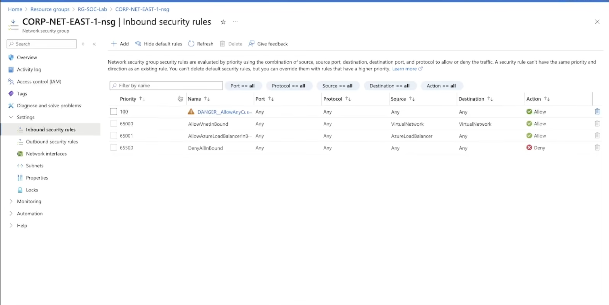

> **Security Warning:** This configuration is intentionally insecure and was used strictly within an isolated cybersecurity lab. Permissive inbound access should not be configured on production systems.

---

## Step 6 – Verify the Virtual Machine

The Azure VM overview was used to verify that the virtual machine was running and connected to the expected network resources.

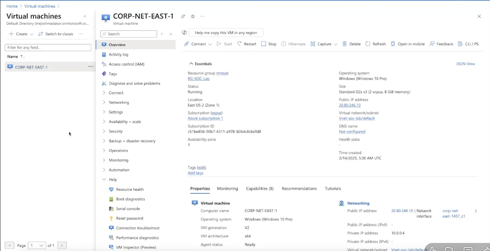

The VM was assigned both private and public network addressing, making the lab endpoint reachable from the Internet.

---

# Security Event Investigation

## Step 7 – Observe Windows Failed Logon Events

After the VM became publicly reachable, failed authentication events began appearing in Windows Event Viewer.

The primary event investigated was:

```text
Event ID: 4625
Activity: An account failed to log on
```

Multiple failed authentication events were observed.

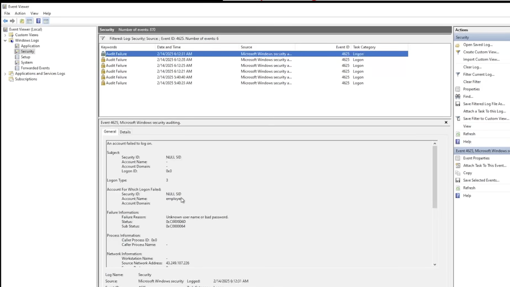

This provided the first indication that external systems were attempting to authenticate to the exposed VM.

---

## Step 8 – Investigate an Individual Failed Login

An individual **Event ID 4625** was examined to identify additional information about the authentication attempt.

Important fields included:

* Account name
* Logon type
* Failure reason
* Authentication package
* Source network address
* Source port

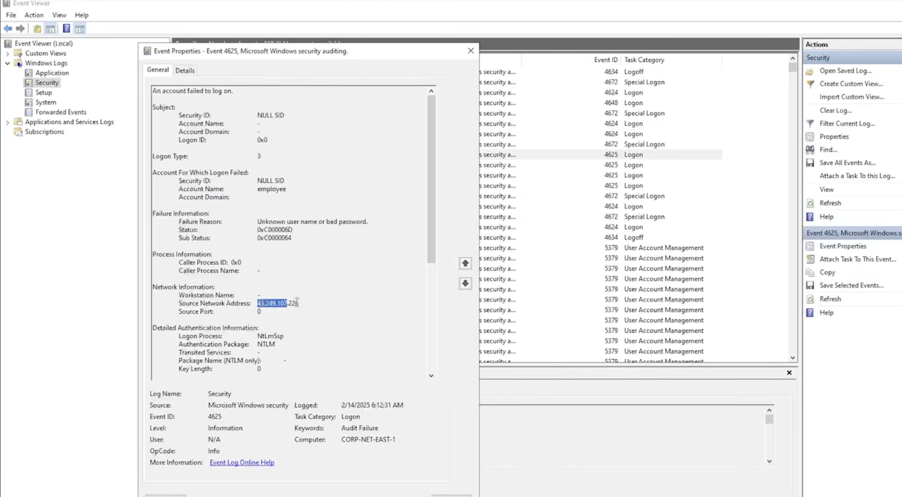

The **Source Network Address** identifies the remote IP associated with the failed authentication attempt and can be used for further investigation and correlation.

---

# Microsoft Sentinel Deployment

## Step 9 – Create a Log Analytics Workspace

A Log Analytics Workspace was created to provide centralized storage and querying of the security telemetry generated by the Windows VM.

```text
LAW-soc-lab-0000
```

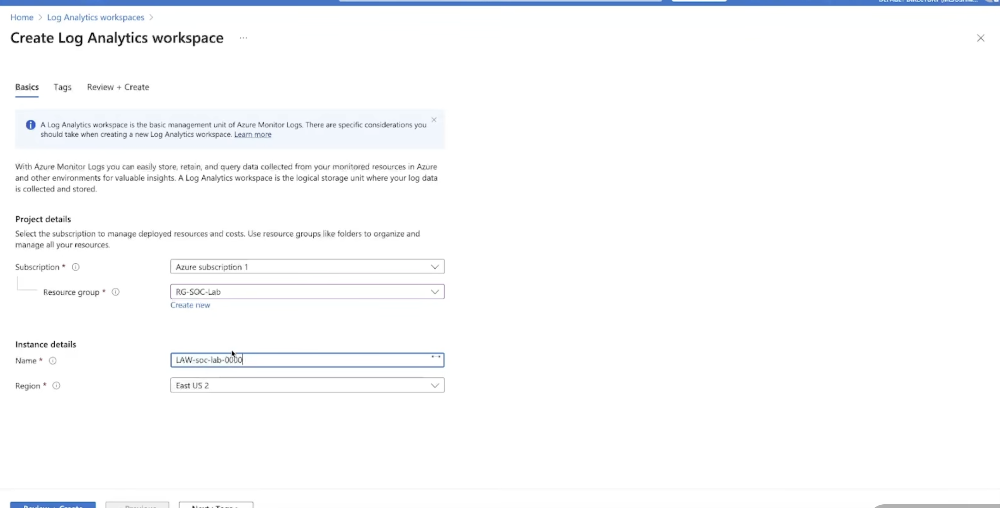

Log Analytics allows the collected security data to be queried using KQL.

---

## Step 10 – Enable Microsoft Sentinel

Microsoft Sentinel was connected to the Log Analytics Workspace to provide SIEM functionality.

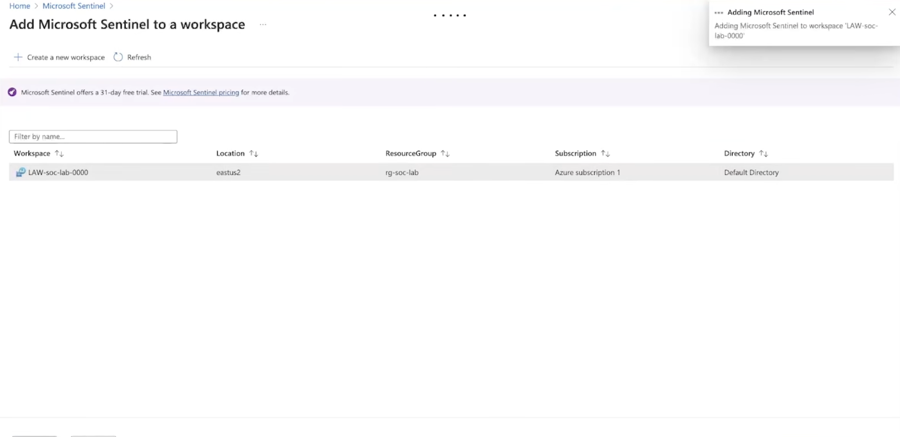

Microsoft Sentinel provides capabilities such as:

* Security monitoring
* Detection
* Investigation
* Threat hunting
* Analytics
* Workbooks
* Security automation

---

## Step 11 – Configure Windows Security Events

The **Windows Security Events** solution was installed through the Microsoft Sentinel Content Hub.

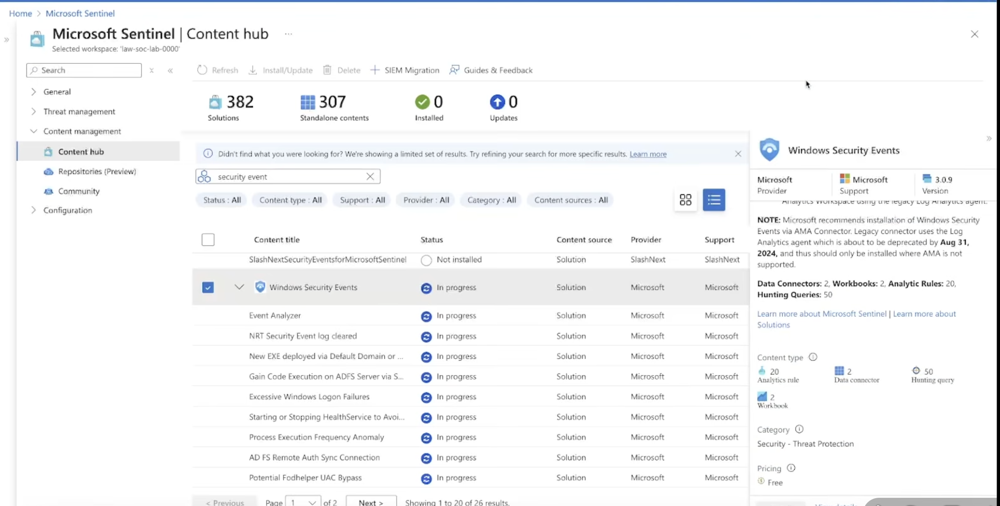

This allows Windows security telemetry to be centralized and analyzed through the Sentinel environment.

---

# KQL Threat Investigation

## Step 12 – Detect Failed Authentication Events

Once Windows Security Events were available in Log Analytics, KQL was used to identify Event ID 4625 activity.

```kusto
SecurityEvent
| where EventID == 4625
| project TimeGenerated, Account, Computer, EventID, Activity, IpAddress
```

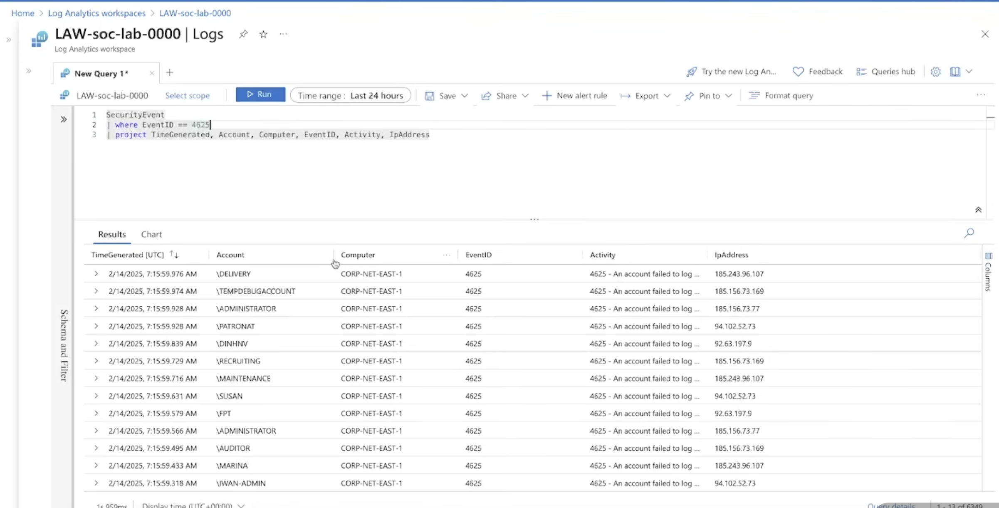

The query displays several useful investigation fields:

* Timestamp
* Attempted account
* Target computer
* Event ID
* Authentication activity
* Source IP address

This made it possible to quickly identify and investigate repeated failed authentication attempts.

---

## Step 13 – Analyze Authentication Patterns

The results showed repeated failed authentication attempts against the Internet-facing Windows system.

Multiple account names and source IP addresses appeared in the security telemetry, allowing authentication activity to be grouped and investigated.

This type of repeated credential guessing is consistent with automated brute-force or password-guessing behavior commonly directed at exposed remote-access services.

---

# Threat Enrichment

## Step 14 – Enrich Source IP Addresses with GeoIP Data

An IP address alone provides limited context. Geographic enrichment was therefore added to the investigation.

A GeoIP watchlist was queried using KQL's `ipv4_lookup` functionality.

```kusto
let GeoIPDB_FULL = _GetWatchlist("geoip");
let WindowsEvents = SecurityEvent
    | where EventID == 4625
    | order by TimeGenerated desc
    | evaluate ipv4_lookup(GeoIPDB_FULL, IpAddress, network);
WindowsEvents
| project
    TimeGenerated,
    Computer,
    AttackerIp = IpAddress,
    cityname,
    countryname,
    latitude,
    longitude
```

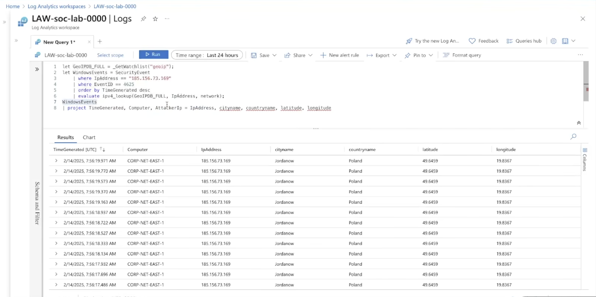

The enrichment process added:

* City
* Country
* Latitude
* Longitude

This allowed the source IP data to be geographically visualized.

> **Note:** IP geolocation indicates the approximate location associated with an IP address. It does not establish the physical location or identity of an attacker.

---

## Step 15 – Aggregate Failed Authentication Activity

The enriched events were aggregated to determine the number of failed authentication attempts associated with each source IP and geographic location.

```kusto
let GeoIPDB_FULL = _GetWatchlist("geoip");
let WindowsEvents = SecurityEvent;
WindowsEvents
| where EventID == 4625
| order by TimeGenerated desc
| evaluate ipv4_lookup(GeoIPDB_FULL, IpAddress, network)
| summarize FailureCount = count()
    by IpAddress, latitude, longitude, cityname, countryname
| project
    FailureCount,
    AttackerIp = IpAddress,
    latitude,
    longitude,
    city = cityname,
    country = countryname,
    friendly_location = strcat(cityname, " (", countryname, ")")
```

This transformed individual failed authentication events into aggregated data suitable for visualization.

---

# Global Attack Visualization

## Step 16 – Build the Microsoft Sentinel Attack Map

A Microsoft Sentinel Workbook was created to visualize the enriched authentication data.

The workbook uses the KQL aggregation query as its data source.

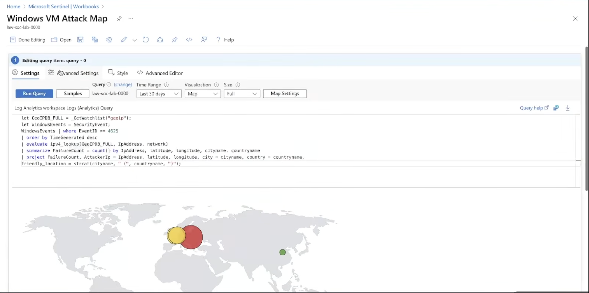

The visualization was configured as a geographic map using latitude and longitude values obtained during GeoIP enrichment.

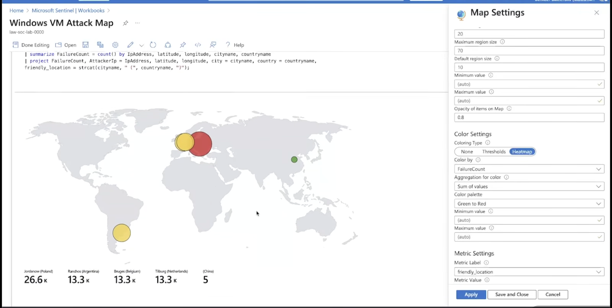

The visualization uses **FailureCount** to represent the relative volume of authentication attempts associated with each mapped location.

---

## Step 17 – Monitor Global Authentication Activity

After the Internet-facing VM collected authentication activity, the completed Microsoft Sentinel Workbook displayed the geographic distribution of the observed source IP addresses.

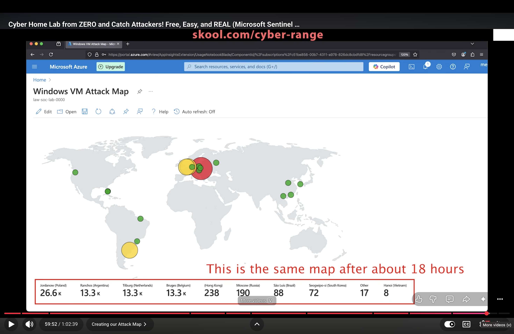

The visualization showed failed authentication activity associated with IP addresses geolocated to several regions around the world.

This demonstrates how SIEM data can be transformed from raw Windows events into an analyst-friendly security visualization.

---

# Key Findings

Several observations were made during the project:

* Failed authentication events appeared after the VM became publicly reachable.
* Windows Event ID **4625** provided detailed authentication telemetry.
* Repeated failed authentication attempts were observed.
* Multiple account names were targeted.
* Source IP addresses could be extracted directly from Windows security telemetry.
* KQL made it possible to filter, investigate, enrich, and aggregate the events.
* GeoIP enrichment provided additional context for source IP addresses.
* Microsoft Sentinel Workbooks transformed raw log data into an understandable geographic visualization.
* Publicly exposed remote-access services can attract significant unsolicited authentication activity.

---

# SOC Analyst Investigation Workflow

```text
Detect
   ↓
Windows Event ID 4625

Investigate
   ↓
Review account, system and source IP

Query
   ↓
Use KQL to identify related activity

Enrich
   ↓
Add geographic context to source IPs

Analyze
   ↓
Aggregate repeated authentication attempts

Visualize
   ↓
Microsoft Sentinel Workbook

Respond
   ↓
Reduce exposure and strengthen access controls
```

---

# Security Recommendations

* Restrict RDP access through Network Security Groups.
* Avoid exposing administrative ports directly to the public Internet.
* Use Azure Bastion or a secure VPN for administrative access.
* Implement Multi-Factor Authentication where applicable.
* Use strong authentication and account policies.
* Monitor Windows authentication events.
* Create Sentinel detection rules for suspicious authentication patterns.
* Apply least-privilege access.
* Investigate repeated authentication failures.
* Continuously monitor exposed infrastructure.

---

# MITRE ATT&CK Mapping

### T1110 – Brute Force

Brute-force techniques involve repeated authentication attempts in an effort to obtain valid account access.

The repeated failed authentication activity observed through Windows Event ID 4625 demonstrates telemetry that SOC analysts can use to identify potential brute-force or password-guessing behavior.

---

# What I Learned

This project strengthened my understanding of:

* Microsoft Sentinel architecture
* Azure Log Analytics
* Windows Security Events
* Windows Event ID 4625
* Kusto Query Language (KQL)
* SIEM investigation workflows
* Authentication attack detection
* Source IP investigation
* Threat enrichment
* IP geolocation
* Microsoft Sentinel Workbooks
* Network exposure
* SOC monitoring and analysis

Most importantly, this lab demonstrated how raw endpoint telemetry can be transformed into useful security intelligence through:

**Collection → Detection → Investigation → Enrichment → Analysis → Visualization**

---

# Project Summary

In this project, I built a cloud-based SOC monitoring lab using **Microsoft Azure and Microsoft Sentinel**.

A Windows virtual machine served as an Internet-facing monitored endpoint. Windows authentication telemetry was centralized in Azure Log Analytics and investigated using KQL.

Failed authentication attempts were identified through **Windows Event ID 4625**. Source IP addresses were extracted, enriched with geographic information, aggregated by authentication volume, and visualized through a Microsoft Sentinel Workbook.

The final result was a global attack map demonstrating the geographic distribution of source IP addresses generating failed authentication attempts against the monitored Windows VM.

---

## Disclaimer

This project was created strictly for **educational and cybersecurity training purposes**.

The intentionally permissive network configuration demonstrated in this lab should **not** be used in a production environment. Exposed lab resources should be isolated, monitored, and secured or removed after testing.
